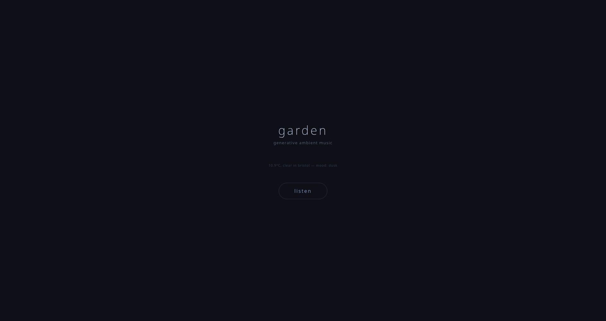

# Garden — Generative Ambient Music

*Four-strategy generative ambient music, browser-native.*



A live ambient music generator that composes continuously using four overlapping strategies:

1. **Eno-style tape loops** — short melodic fragments looped at different rates, drifting out of phase with each other.
2. **Markov-chain melodies** — probabilistic note transitions over modal scales, parameterised by current mood.
3. **Cellular-automaton rhythm** — a 1D CA evolves the percussion layer each bar.
4. **Spectral drift** — a beating harmonic series whose partials slowly detune against each other.

**Features:** 8 voices, convolution reverb, granular shimmer layer, rain ambience, 6 moods (serene / melancholic / hopeful / tense / playful / nocturnal), automatic mood drift, optional live weather input that biases mood.

Pure Web Audio — no samples, no external libraries, no build.

**Run:**
```bash
python3 server.py   # localhost:8115, then press PLAY
```
