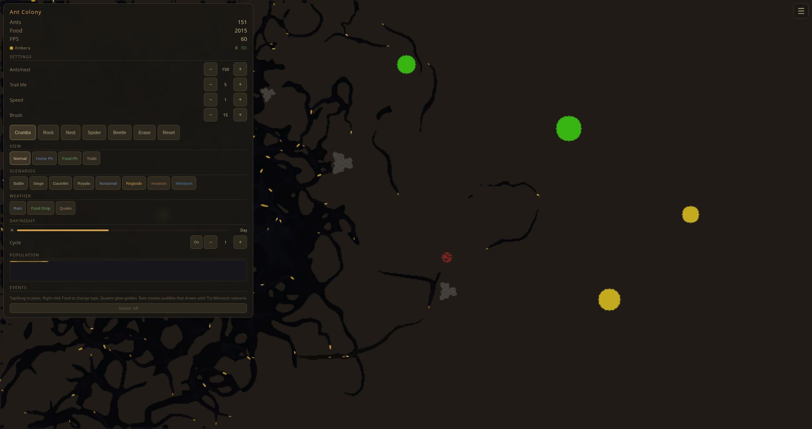

# Ant Colony

*Pheromone-based ant-colony simulator with queens, puddles, predators, and 9 scenarios.*



Hundreds of ants forage food, lay pheromone trails, defend nests, fight rival colonies, and occasionally drown in puddles. Ants use a spatial hash for neighbour queries and a Float32Array pheromone grid for trail following. Trails wear down with use and form natural "highways" between heavily-used paths.

**Features:** Queens with health — kill a queen and her colony collapses; colony splitting (a founding queen leaves the nest when food is plentiful); rain that creates puddle clusters, washes pheromones, drowns ants caught in deep water, and sends splash ripples; beetle tanks that march toward nests; spiders that ambush stragglers; 9 scenarios (Battle / Siege / Gauntlet / Royale / Nocturnal / Regicide / Invasion / Monsoon / default); three food types; ambient sound; day/night cycle; touch-friendly.

**Run:**
```bash
python3 server.py   # localhost:8119
```
