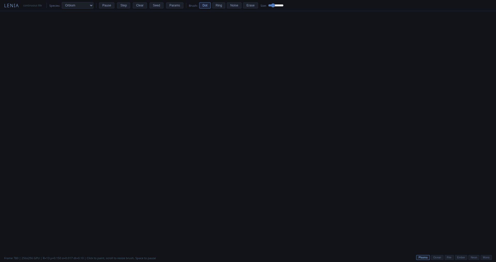

# Automata Lab

*Cellular and agent-based simulations: Lenia, Fluid, WFC, Evolution, L-systems, Reaction-Diffusion.*



A cluster of simulations sharing a common lab front door:

- **Lenia** (`/lenia.html`) — continuous cellular automaton. Smooth organisms glide across a field of floating-point density.
- **Fluid Dynamics** (`/fluid.html`) — 2D Navier-Stokes with Jacobi pressure solve and a bloom pass.
- **Reaction-Diffusion** (`/reaction.html`) — Gray-Scott with 8 parameter presets.
- **Wave Function Collapse** (`/wfc.html`) — 6 tilesets, ghost superposition rendering, backtracking on contradictions, auto-cycle.
- **Evolution** (`/evolution.html`) — neural-network creatures with sexual reproduction and speciation tracking across 9 scenarios.
- **L-systems** (`/lsystem.html`) — 12 presets, 6 colour schemes, animated grow.

All algorithmic. No art assets.

**Run:**
```bash
python3 server.py   # localhost:8087
```
