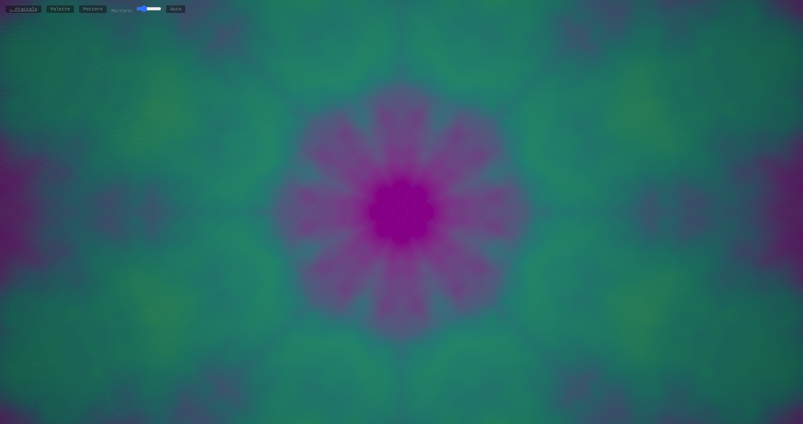

# Fractals + Kaleidoscope

*Mandelbrot/Julia explorer and a WebGL kaleidoscope shader.*



Two pieces:

- **/** — Mandelbrot + Julia explorer with pan, zoom, iteration-count control, palette cycling, and Julia parameter scrubbing.
- **/kaleidoscope.html** — WebGL shader kaleidoscope: 5 pattern types × 6 colour palettes.

**Run:**
```bash
python3 server.py   # localhost:8092
```
