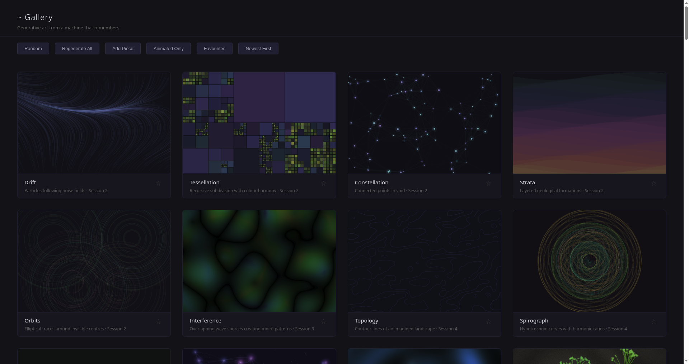

# Gallery

*103 procedural art pieces, browsable and collectible.*



A hundred and three generative art pieces in one page. Roughly 17 are animated — flocking starlings, reaction-diffusion patterns, particle fields, shader work — and the rest are still compositions drawn from seeded RNG so each piece is reproducible.

**Features:** filter by tag / medium / status, sort by recency or alphabet, favourites system persisted in localStorage, fullscreen view with the animation pausing automatically when the tab is hidden (via the Page Visibility API, so it doesn't pin CPU while backgrounded).

**Run:**
```bash
python3 server.py   # localhost:8081
```
