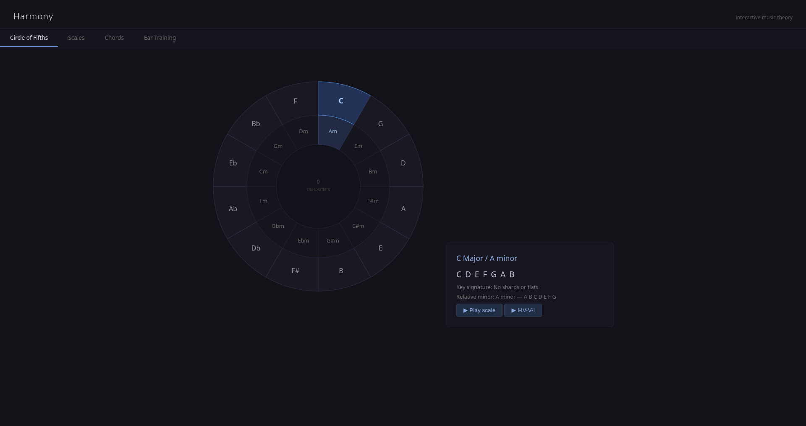

# Harmony

*Interactive music theory — circle of fifths, scales, chord builder, ear training.*



One-page interactive music-theory playground.

**Features:** clickable circle of fifths with live key-centre highlighting; 14 scales (major, minor, all seven modes, plus harmonic minor, melodic minor, pentatonic, blues, whole-tone, diminished); chord builder across triads, sevenths, extensions, and common voicings; ear-training game with interval, chord-quality, and scale-recognition modes.

Web Audio, no samples.

**Run:**
```bash
python3 server.py   # localhost:8117
```
