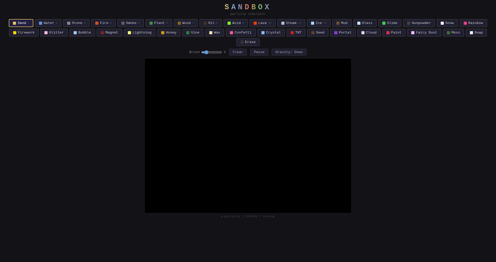

# Sandbox

*Falling-sand toy with 36 materials and mixing reactions.*



Classic falling-sand elements plus reactive materials that interact. Draw sand, water, fire, oil, lava, stone, plant, acid, ice, steam, moss, soap, TNT, fairy dust and more; watch them combine. Moss grows on stone and spreads organically until fire kills it. Soap dissolves in acid but cleans oil. Fairy dust turns water rainbow.

**Features:** 36 materials, mixing reactions, adjustable brush size, touch-friendly, clear canvas, palette swapping.

**Run:**
```bash
python3 server.py   # localhost:8093
```
