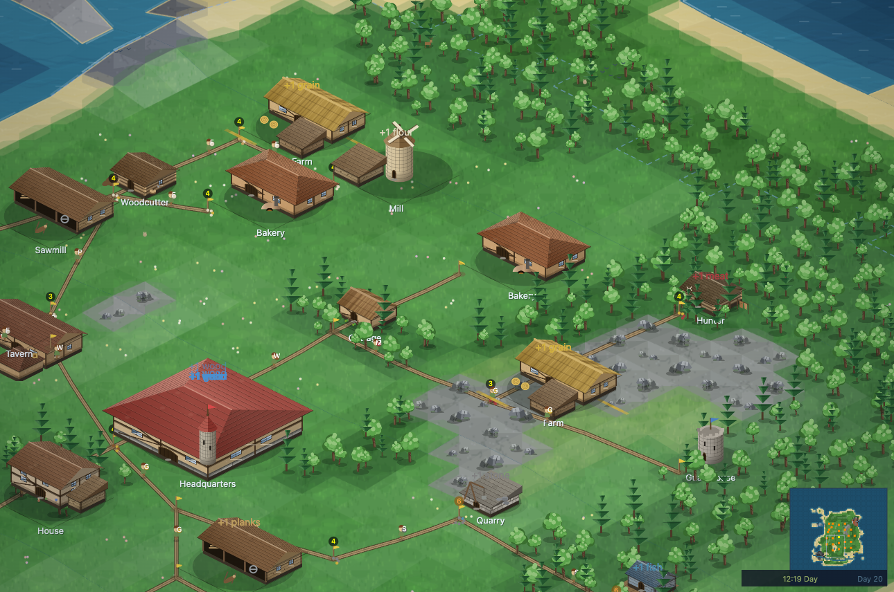

# Settlers

*Resource-management village builder inspired by Settlers 2.*



Build a self-sustaining medieval village. Chop wood, mine iron, grow grain, bake bread, smelt weapons, feed your villagers. Carriers walk goods between buildings along flag-connected roads; congestion warnings appear when a flag is overloaded. Population and happiness are real — each working building needs a free worker, and morale comes from food variety, housing density, and taverns.

**Features:** 21 building types in 6 categories (resource / mine / process / military / housing / special), procedural terrain on an 80×80 isometric map, rivers that meander procedurally and allow fisher-hut placement on sandy banks, full production chains (logging → sawmill → carpenter, wheat → mill → bakery, iron + coal → smelter → weaponsmith), population & happiness system, day/night cycle, ambient Dorian/Aeolian music (toggle with `M`), save/load to localStorage (auto-save every 60 s; Ctrl-S / Ctrl-L).

**Rendering:** true isometric terrain relief — per-corner elevation with directional slope shading and procedural texture patterns (grass blades, sand ripples, rock cracks), baked into an offscreen world cache (one blit per frame instead of 6,400 tile draws). All assets are procedural sprites rendered once at 3× supersample, with real materials: lap-board plank walls with knots, plaster with timber framing, mortared stone courses, shingle rows with staggered notches, streaked thatch with ridge caps, ambient occlusion and directional shadows. Every building type has a distinct silhouette built from a composition kit — the mill is a round stone tower with a rotating sail wheel, the sawmill an open-sided cutting shed, the farm a thatched longhouse with barn and hay bales, mines are timber portals in rock mounds with ore carts, the guardhouse a crenellated watchtower, the bakery a cottage with a clay oven dome. Trees come in deciduous (leaf-cluster canopies; bare snow-lined branches in winter) and evergreen conifer variants that dominate high ground. Depth-shaded water with shore foam and animated glints, feathered terrain transitions, elevation-following dirt roads, depth-sorted entities, drifting cloud shadows, seasonal crossfades, and warm lit windows after dusk.

~5600 lines. The design sensibility comes straight from Blue Byte's 1996 Settlers 2 — "the fun is making a self-sustaining village, not conquering the world."

**Run:**
```bash
python3 server.py   # localhost:8120
```
