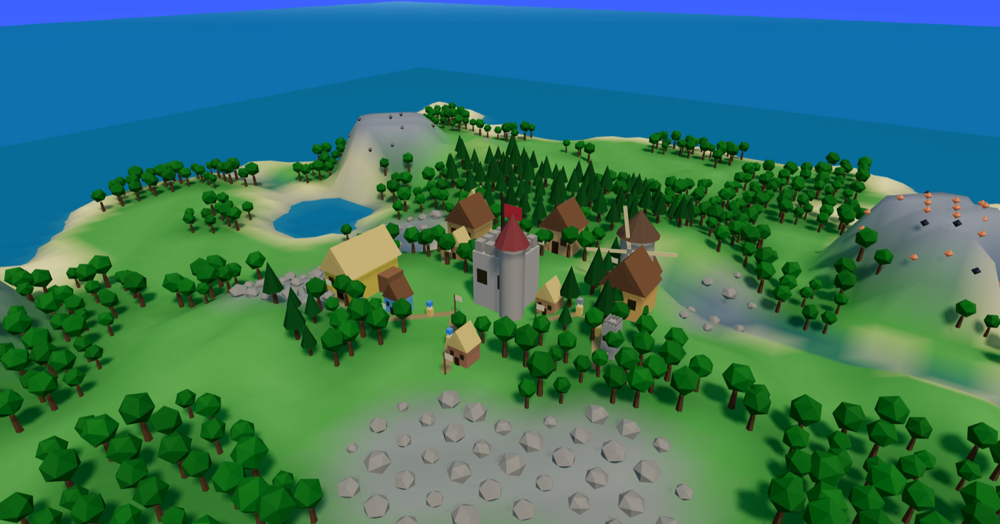

# Settlers 3D

*The [Settlers](../settlers/) village economy — same simulation, real-time 3D renderer.*



A demonstration that when you "upgrade a game's graphics", the **simulation is the part you keep and the renderer is the part you replace**. The entire live economy here is lifted *verbatim* from the 2D [settlers](../settlers/) project — production chains, the flag/road carrier network, placement rules, population, happiness and seasons. Only the renderer and controls are new: a WebGL camera you orbit, a real sun casting real shadows, and carriers that physically plod goods between buildings.

In the source, everything between the `>>> LIFTED SIM <<<` and `>>> END LIFTED SIM <<<` markers is copied unchanged from `../settlers/index.html`. The 2D game touched its canvas at only a handful of seams (mouse picking, floating-text positions, a tile-dirty flag, sound, HUD refresh); those are stubbed or redirected, and the 3D layer reads the same arrays.

**Play it:** pick a building from the palette, click a green tile to place it (red = blocked). Each building drops a flag and auto-connects a road to your network; carriers then walk goods to your HQ. **R** road mode, **X** demolish, **Space** pause, **1/2/3×** speed. Your village **auto-saves** to the browser (every 30 s) and resumes on reload — **Ctrl-S / Ctrl-L** to save/load by hand, **New map** to start fresh.

**Simulation (lifted from 2D Settlers):** 21 building types in 6 categories, procedural terrain + meandering rivers, full production chains (wood → planks; grain → flour → bread; iron-ore + coal → iron → tools; gold → coins), a flag-and-road logistics network with one carrier per road doing smart pickup, territory that expands as you build guardhouses, population & happiness driven by food variety / housing / taverns / wealth, and a four-season cycle that modifies output.

**Renderer (new, Three.js):** a vertex-coloured heightmap mesh built from the sim's per-corner elevation; a single directional sun with soft shadow maps and a gradient sky dome, both tinted across a day/night cycle (moonlit nights with windows that light up); instanced conifer/deciduous forests that favour high ground; rock clusters and glowing ore crystals on the mineral peaks; distinct low-poly building silhouettes (crenellated castle keep, a windmill with turning sails, gable cottages, guard towers, timber mine portals); ground-following road ribbons; carriers that show the coloured good they're hauling; a translucent animated sea extended past the map edge; and a translucent build-preview ghost.

**Differences from the 2D game:** the map is enlarged (100×100 vs 80×80) and the starting territory widened so there's room to build under a 3D camera; carrier pace and the day-length are slowed for watching rather than glancing. These are tuning constants — the simulation logic is unchanged, and each tweak is commented where it's set.

**Dependency note:** this is the one showcase project that uses a 3D library. [Three.js](https://threejs.org) (r161) is **vendored locally** under `vendor/` (`three.module.js` + `OrbitControls.js`), so the project stays fully self-contained and runs offline — no CDN, no build, no install.

**Run:**
```bash
python3 server.py   # localhost:8123
```
