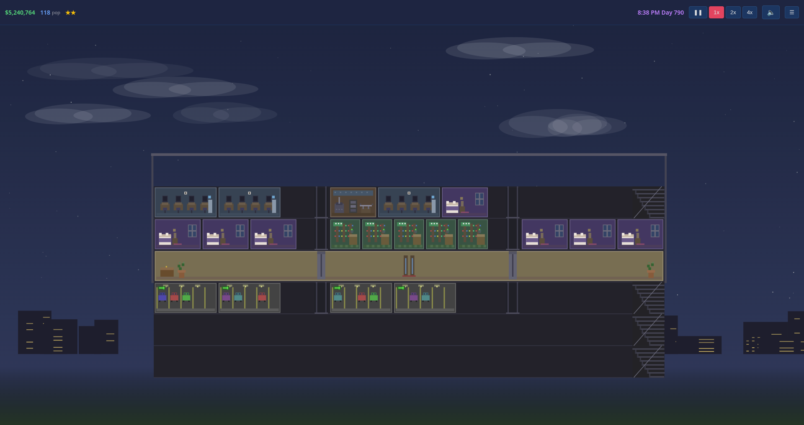

# Tower Sim

*Sim Tower-style high-rise builder with noise propagation and named residents.*



Place floors, elevators, apartments, offices, shops, hotels, and restaurants to grow a tower economy. Named residents move in, work, shop, and eat — click any of them to inspect their current destination, stress level, and happiness.

**Features:** 12 room types + 3 basement parking floors; noise system where rooms emit noise that propagates to neighbours (toggle heat map with `N`); stress system driven by noise exposure and elevator waits (stressed residents eventually leave); three elevator tiers with LOOK scheduling; day/night cycle; city skyline backdrop; weather (rain dampens noise transmission); ambient audio; touch UI; save/load.

~2000 lines across 10 JS modules. Inspired by Maxis' 1994 Sim Tower.

**Run:**
```bash
python3 server.py   # localhost:8121
```
