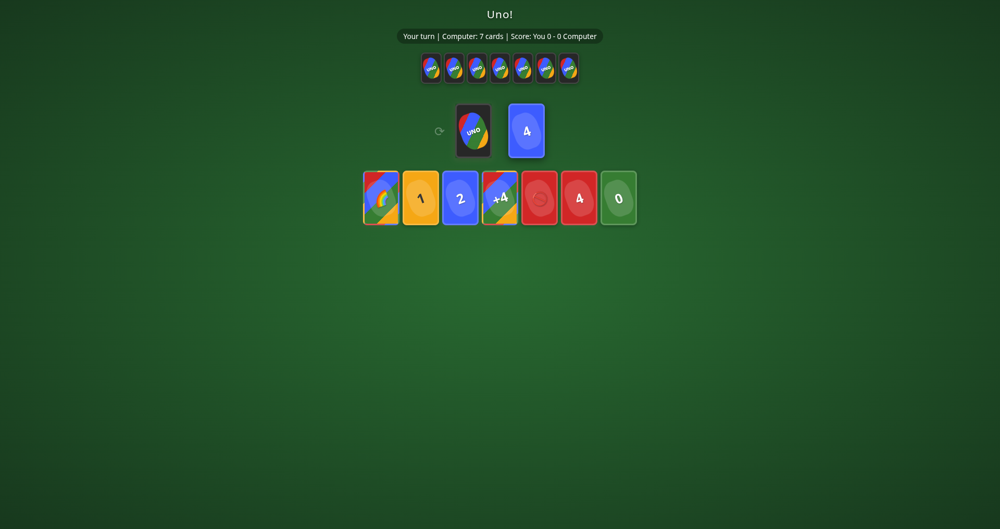

# Uno

*The card game Uno with AI opponents.*



Two-to-four-player Uno against simple strategic AI. Draw piles, discard piles, colour-picker modal for wild cards, stackable +2 and +4 cards (optional house rule), UNO-call button for the last-card penalty. Touch-friendly.

**Run:**
```bash
python3 server.py   # localhost:8105
```
