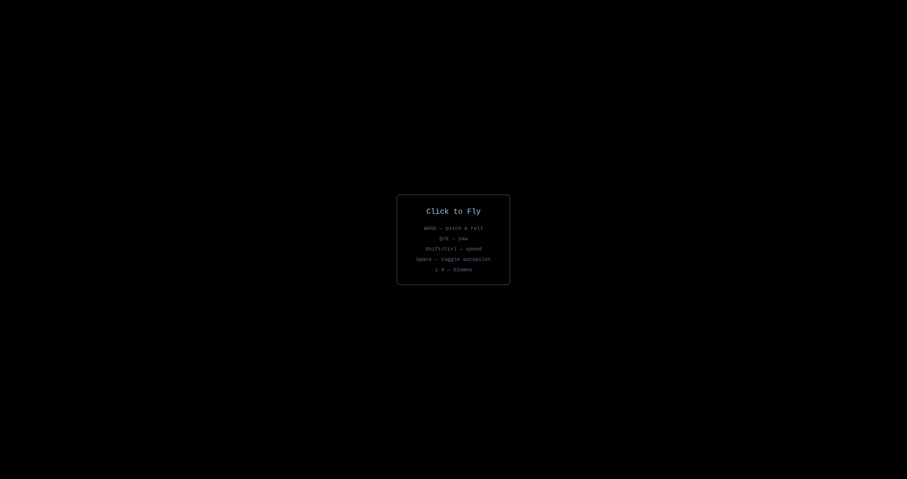

# Voyage

*Cluster of WebGL shader pieces — oceans, planets, terrain, aurora.*



Six shader-driven visual pieces behind one front door:

- **Ocean** (`/`) — raymarched sea with sun reflection, foam, and drifting cloud layer.
- **Procedural Planet** (`/planet.html`) — 5 planet types with biome gradients, atmosphere halo, cloud layer.
- **Terrain Flyover** (`/terrain.html`) — 4 biomes, autopilot or manual flight, compass HUD.
- **Strange Attractors** (`/attractors.html`) — Lorenz / Rössler / Aizawa / more, accumulated in a framebuffer.
- **Landscape Generator** (`/landscape.html`) — Terragen-style vista renderer: ray-marched terrain, clouds, haze, water. 6 presets × 4 palettes.
- **Aurora Borealis** (`/aurora.html`) — multi-layer curtains, shooting stars, lake reflection.

All single-file HTML + WebGL1 (Intel Iris Xe compatible). No dependencies.

**Run:**
```bash
python3 server.py   # localhost:8118
```
