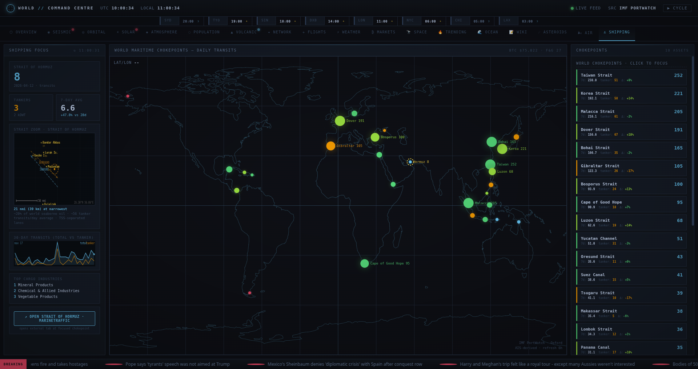

# World Command Centre

*Real-time global-stats dashboard: 17 tabs, 25+ public APIs, no keys.*



A dark "command centre" UI that aggregates live data from two-dozen-plus public APIs into one kiosk-style dashboard. Designed to run full-screen on a spare monitor.

**Tabs:**

| Tab | Source | What it shows |
|---|---|---|
| Seismic | USGS | Last 24 h of earthquakes, ranked + mapped |
| Orbital | CelesTrak + sgp4 | ISS, Tiangong, 17 bright satellites with ground tracks |
| Solar | NOAA SWPC | Kp index, solar wind, X-ray flux, aurora OVATION |
| Atmosphere | Open-Meteo | 69 world cities — hottest / coldest / windiest |
| Population | World Bank | Live-ticking global counter + country rankings |
| Volcanic | NASA EONET | Active volcanoes, wildfires, storms |
| Network | TeleGeography | Submarine-cable backbone |
| Flights | OpenSky | Live aircraft positions |
| Weather | GDACS + NWS | Active alerts worldwide |
| Markets | CoinGecko | BTC chart + top coins + Fear & Greed |
| Space | NASA APOD | Astronomy picture of the day |
| Trending | GitHub + HN | New repos + top stories |
| Ocean | NOAA NDBC | Buoy sea-surface temperatures + ENSO index |
| Wiki | Wikimedia EventStreams | Live Wikipedia edits (SSE stream) |
| Asteroids | NASA NEO | Near-Earth objects + approach diagram |
| Air Quality | Open-Meteo AQ | World AQI rankings |
| Shipping | IMF PortWatch | Maritime chokepoints, daily AIS transits, Strait of Hormuz focus |

Chrome features: world-clock strip, BBC news ticker, tab alert badges, map tooltips on every data layer, kiosk auto-cycle, keyboard shortcuts.

**Excluded in this build:** a location-specific local weather widget and a home-network / NAS telemetry panel have been removed; they required private endpoints. The Shipping tab's "OPEN IN MARINETRAFFIC" button deep-links to marinetraffic.com rather than embedding it (their `X-Frame-Options` header forbids framing).

~2100 lines server, ~5900 lines HTML, zero build tools, zero keys.

**Run:**
```bash
python3 server.py   # localhost:8122
```
